**Langkah** **Praktikum**

> 1\. Routing Dasar (Static Routing) b. Tambahkan Halaman About
>
> 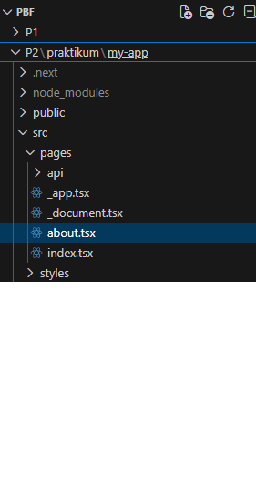 style="width:2.92708in;height:5.68607in" />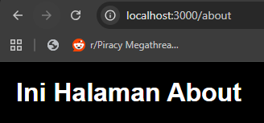 style="width:3.41667in;height:1.59375in" />

> c\. Uji di Browser
> 2\. Routing Menggunakan Folder a. Rapikan Struktur Pages
> 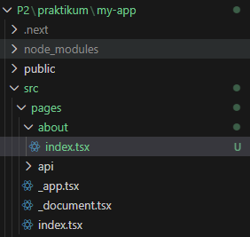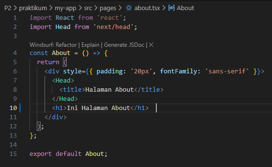

> b\. Akses dari halaman browser ( tetap sama tetapi lebih rapi )
>
> 3\. Nested Routing
>
> a\. Buat Folder Setting
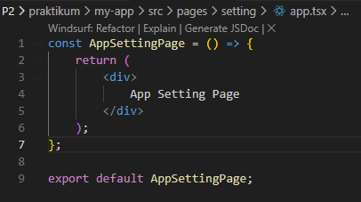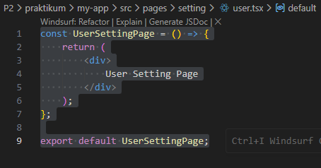

> Modifikasi kodenya
>
> Akses:
>
> • /setting/user
>
> 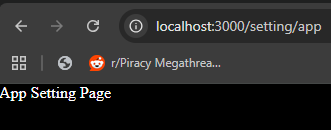 style="width:3.44792in;height:1.35417in" />• /setting/app
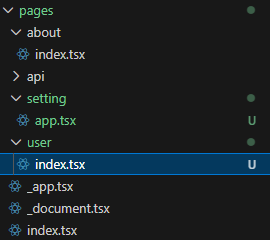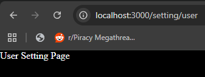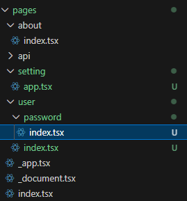

> Modifikasi struktur folder pages dengan menambahkan folder user dan
> user.tsx pada setting dipindah ke folder user dan rubah file user.tsx
> menjadi index.tsx
>
> Jalankan pada browser
>
> b\. Nested Lebih Dalam
>
> Akses: /setting/user/password
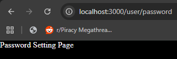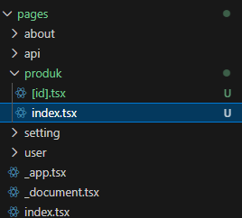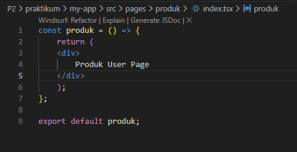

> 4\. Dynamic Routing
>
> a\. Buat Halaman Produk
>
> • Modifikasi index.tsx
>
> • Modifikasi \[id\].tsx
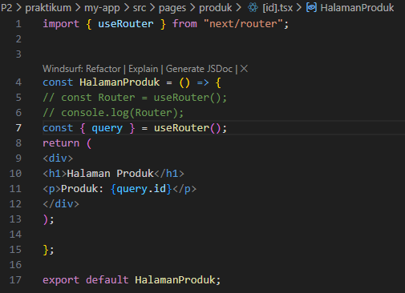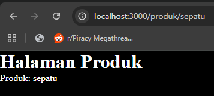
> 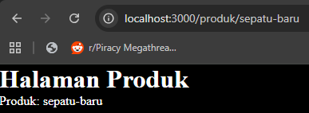 style="width:4.03125in;height:1.47917in" />c. Uji di Browser
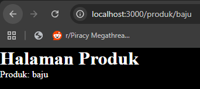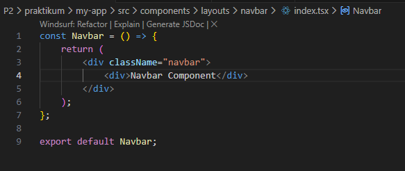

> 5\. Membuat Komponen Navbar a. Struktur Komponen
>
> • Modifikasi index.tsx
>
> • Modifikasi global.css
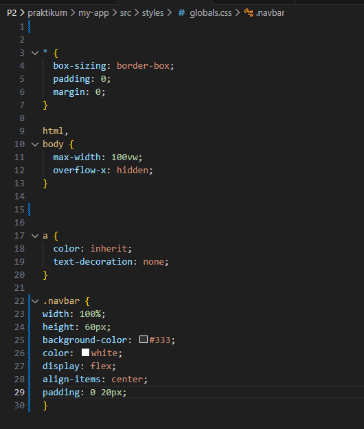

> • Modifikasi index.tsx pada folder pages
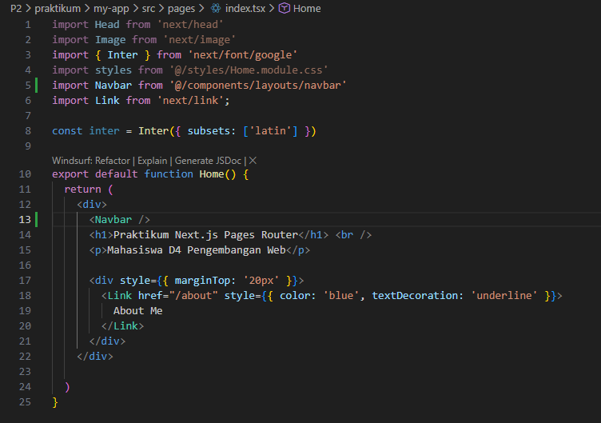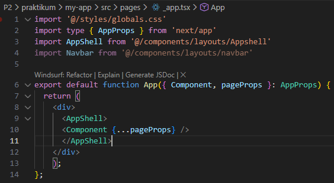

> • Modifikasi \_app.tsx ( pastikan import styles dalam keadaan aktif)
>
> • Jalankan di browser ( Navbar akan tampil )
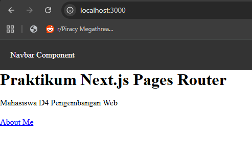
> 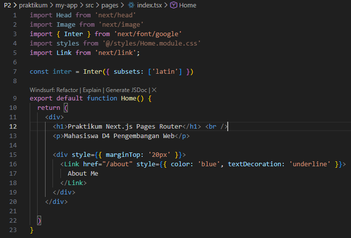•

> Modifikasi navbar agar tampil di semua page
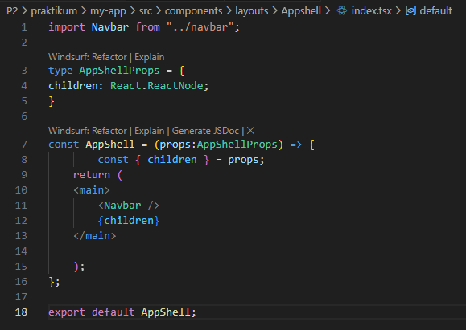

> • Jalankan browser
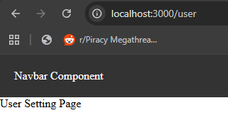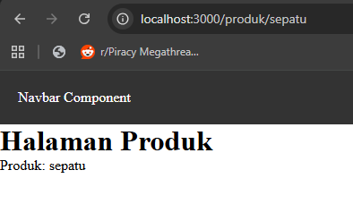

> 6\. Membuat Layout Global (App Shell) a. Buat AppShell
>
> • Modifikasi index.tsx pad AppShell

> 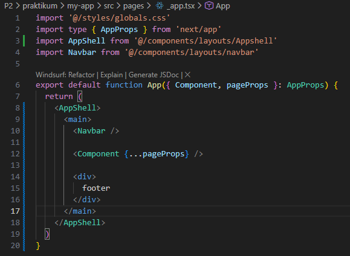

>7. Implementasi Layout di
> \_app.tsx
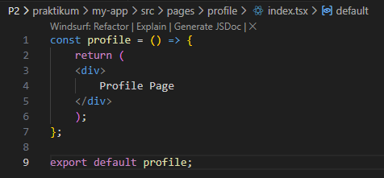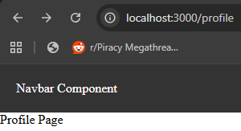

**Tugas** **Praktikum**

Tugas 1 – Routing 1. Buat halaman: • /profile

• /profile/edit

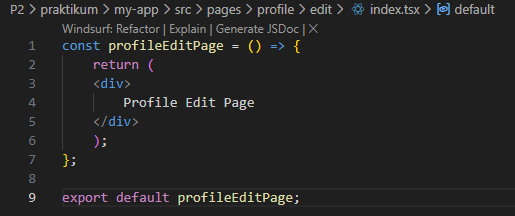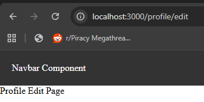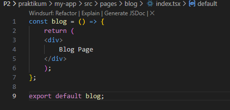

2\. Pastikan routing berjalan tanpa error

Tugas 2 – Dynamic Routing 1. Buat routing:

2\. /blog/\[slug\]

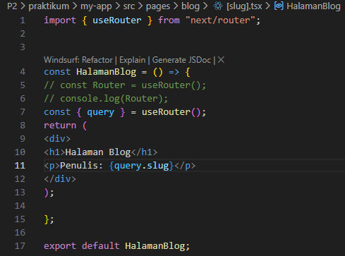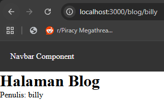

3\. Tampilkan nilai slug di halaman

Tugas 3 – Layout

1\. Tambahkan Footer pada AppShell

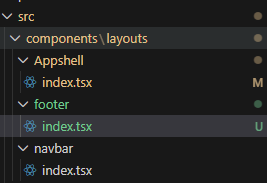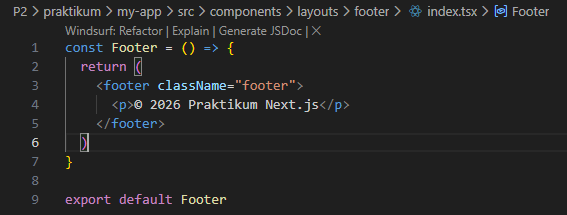

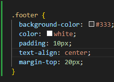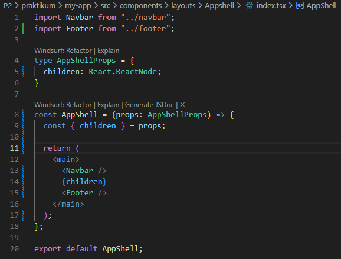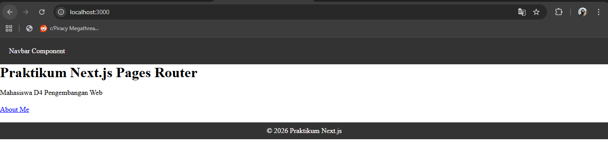

2\. Footer tampil di semua halaman

F. Pertanyaan Refleksi

1\. Apa perbedaan routing berbasis file dan routing manual?

Jawab: Routing berbasis file adalah sistem routing yang otomatis dibuat
berdasarkan struktur folder dan nama file di dalam project. Sedangkan
routing manual adalah routing yang harus didefinisikan sendiri oleh
developer di dalam kode, biasanya menggunakan konfigurasi atau komponen
khusus.

2\. Mengapa dynamic routing penting dalam aplikasi web?

Jawab: Dynamic routing penting karena memungkinkan aplikasi menampilkan
halaman berdasarkan data yang berubah-ubah, seperti. Dengan dynamic
routing, kita tidak perlu membuat banyak file halaman secara manual
untuk setiap data. Cukup satu template halaman, lalu data ditentukan
dari parameter URL. Ini membuat aplikasi lebih efisien, mudah
dikembangkan, dan cocok untuk aplikasi berbasis data besar.

3\. Apa keuntungan menggunakan layout global dibanding memanggil
komponen satu per satu?

Jawab: Layout global digunakan untuk menampung komponen yang selalu
muncul di semua halaman, seperti Navbar dan Footer.
