**Langkah** **Praktikum**

> 1\. Langkah 2 – Membuat Catch-All Route 
>
> Buat folder shop dan file […slug].tsx:
>
>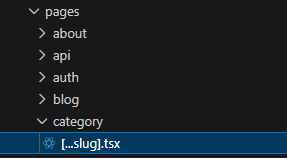

> Modifikasi Isi file \[…slug\].tsx dengan kode berikut:
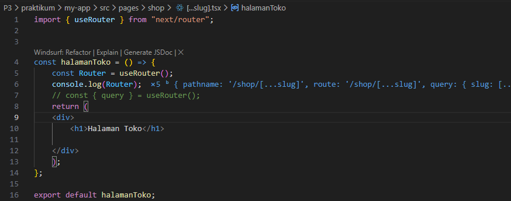

> Cek menggunakan console.log apakah nilai segment berhasil didapat
> Jalankan browser dan ketik urlnya sebagai berikut
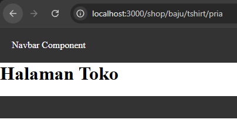

>
> Cek Vscode jika pada console.log dapat menampilkan nilai querynya berarti berhasil
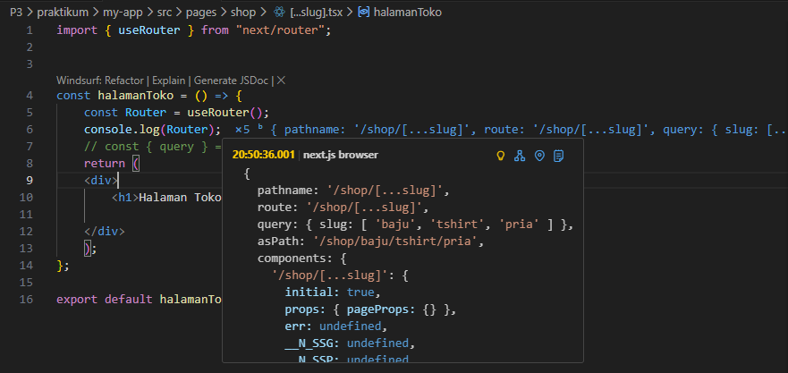

> Modifikasi \[...slug\].tsx untuk menampilkan nilai query

> 2\. Langkah 3 – Pengujian Catch-All Route Akses URL berikut di browser: 
>
>/shop/clothes
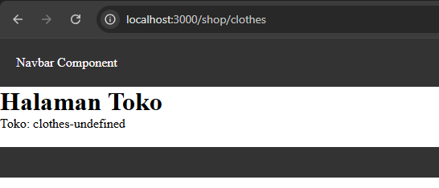
>
> /shop/clothes/tops
> 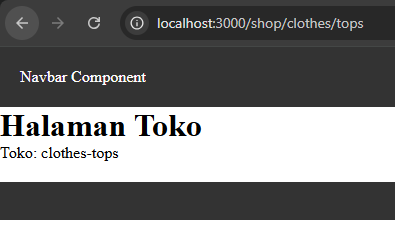
>
> /shop/clothes/tops/t-shirt
> 

> Modifikasi \[…slug\].tsx menjadi berikut
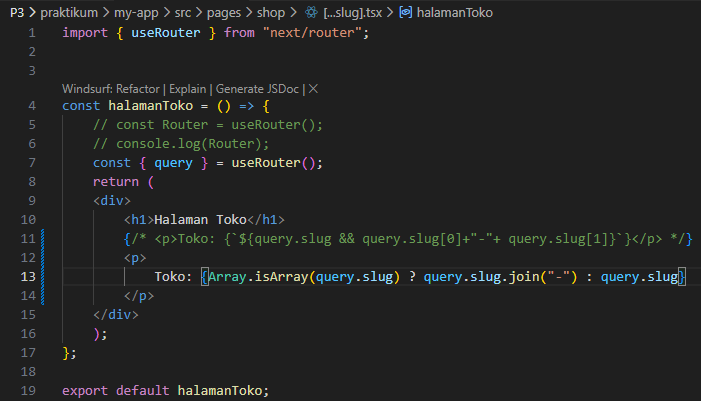

>Jalankan browser : Berapapun banyaknya seqment tetap terbaca
> 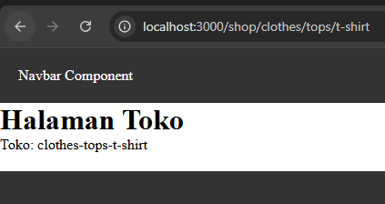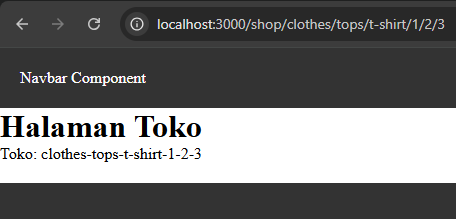

> 3\. Langkah 4 – Optional Catch-All Route
>
> 1\. Jika menggunakan \[...slug\].js maka ketika mengakses shop akan terjadi error 2. Solusinya dengan Rename file: \[...slug\].js → \[\[...slug\]\].js
>
>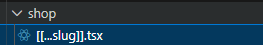

> 3\. Sekarang akses: /shop
>
>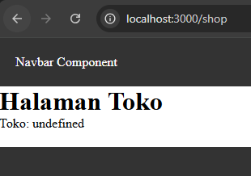
>
> 4\. Halaman dapat diakses meskipun tanpa parameter.

> 4\. Langkah 5 – Validasi Parameter
>
> Tambahkan validasi agar tidak error saat slug kosong:
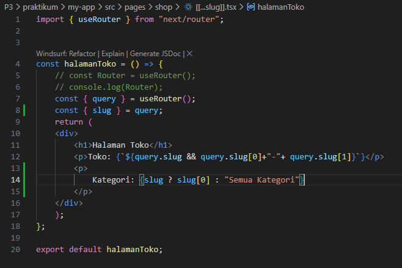

> 5\. Langkah 6 – Membuat Halaman Login & Register Buat file:

>
> o login.jsx
>
> o register.jsx

> Modifikasi login.jsx:
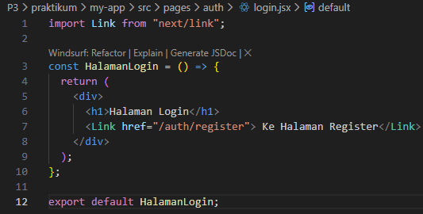

> Modifikasi register.jsx:
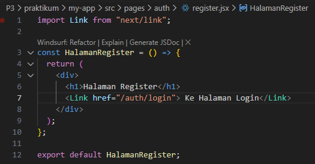

> 6\. Langkah 7 – Navigasi Imperatif (router.push)
>
> Tambahkan buttonlogin:
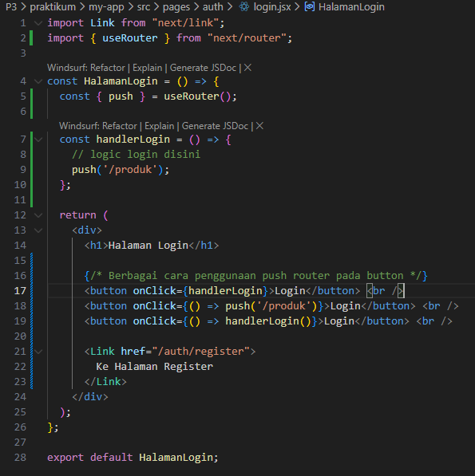
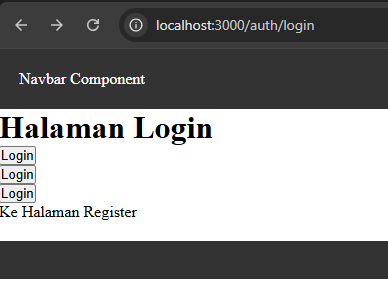

> 7\. Langkah 8 – Simulasi Redirect (Belum Login)
>
> Di halaman product, pada index.tsx tambahkan beberapa code berikut:
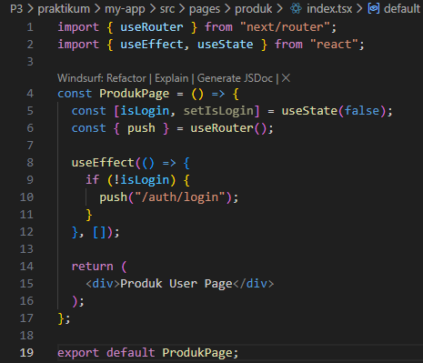

**E.** **Tugas** **Praktikum** Tugas 1 (Wajib)

• Buat catch-all route:

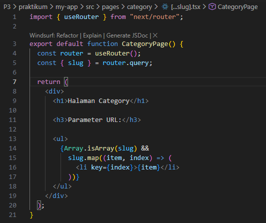

• /category/\[...slug\].js

• Tampilkan seluruh parameter URL dalam bentuk list.

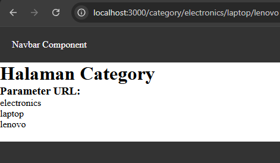

Tugas 2 (Wajib) • Buat navigasi: o Login → Product (imperatif)

o Login ↔ Register (Link)

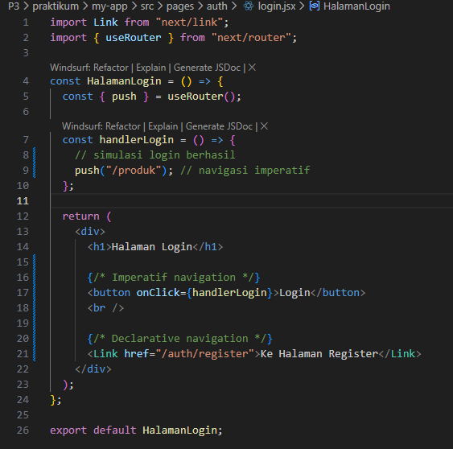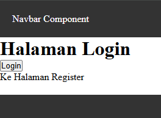

Tugas 3 (Pengayaan)

• Terapkan redirect otomatis ke login jika user belum login.

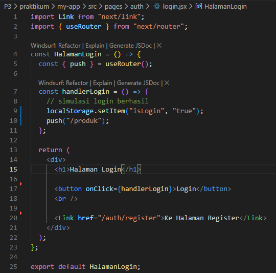

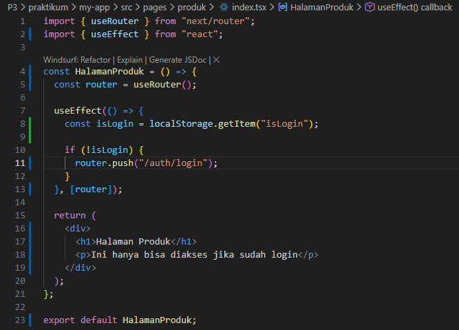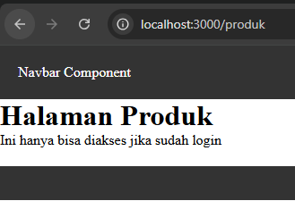

Pada tugas ini diterapkan mekanisme redirect otomatis menggunakan
useRouter dan useEffect. Sistem akan memeriksa status login pada
localStorage. Jika user belum login, maka akan otomatis diarahkan ke
halaman login sebelum dapat mengakses halaman produk.

**F.** **Pertanyaan** **Evaluasi**

1\. Apa perbedaan \[id\].js dan \[...slug\].js?

Jawab: \[id\].js hanya menangkap 1 parameter, sedangkan \[...slug\].js
dapat menangkap banyak segmen URL sekaligus.

2\. Mengapa slug berbentuk array?

Jawab: Karena \[...slug\] menangkap lebih dari satu bagian path URL,
sehingga disimpan dalam bentuk array.

3\. Kapan sebaiknya menggunakan Link dan router.push()?

Jawab: Link digunakan untuk navigasi lewat klik/tampilan, sedangkan
router.push() digunakan untuk navigasi lewat logika program (imperatif).

4\. Mengapa navigasi Next.js tidak me-refresh halaman?

Jawab: Karena Next.js memakai client-side routing, sehingga hanya konten
halaman yang diganti tanpa reload penuh.
